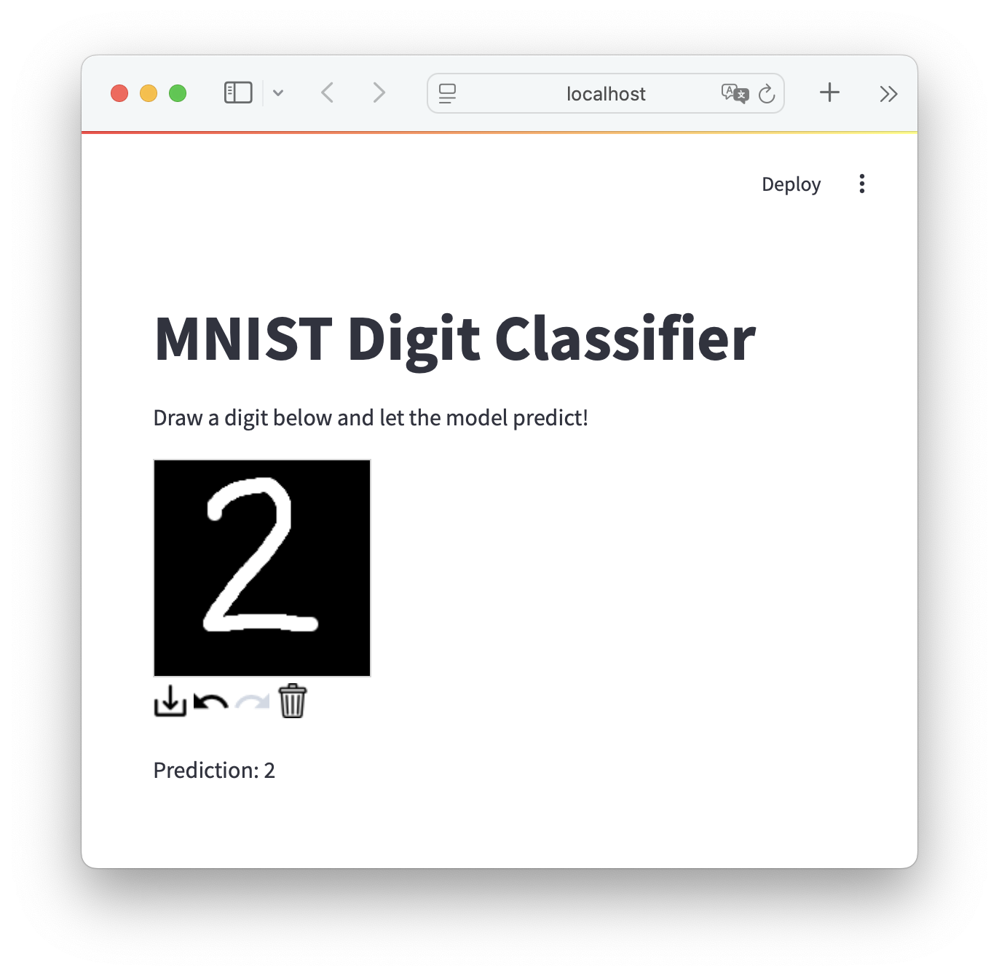

# MNIST Classifier WebApp

A simple WebApp interface for a trained MNIST model. 


## Requirements
- [Pytorch](https://pytorch.org)
- [Streamlit](https://streamlit.io):
    ```bash
    pip install streamlit
    ```
- [Streamlit Drawable Canvas](https://github.com/andfanilo/streamlit-drawable-canvas): 
    ````bash
    pip install streamlit-drawable-canvas
    ```` 
- Matplotlib: 
    ````bash
    pip install Matplotlib
    `````

## Running the App
Run `mnist_classifier.py` to train the model again. A pretrained model is located in the `models` folder.

Run ``streamlit run st_app.py`` to run the WebApp in the browser. Draw in the canvas and the model will predict automatically.

